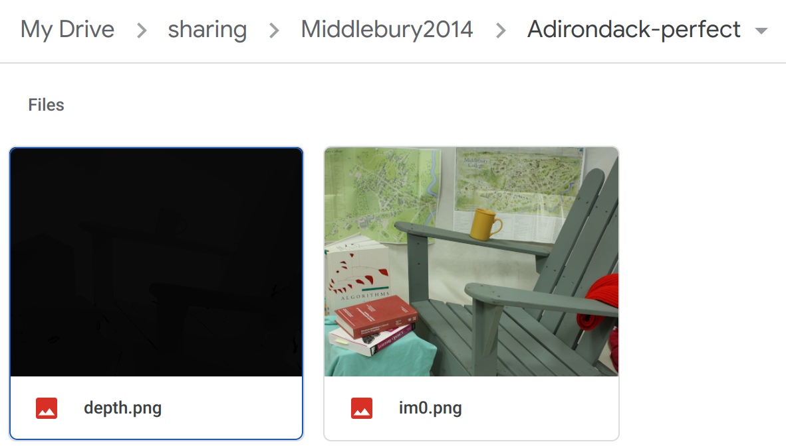

# Middlebury-Depth-Map

Middlebury Stereo Datasets contain real-world stereo images and disparity maps for multiple vision tasks. To download the datasets, please go to the [official website](https://vision.middlebury.edu/stereo/data/).

Loading *.pfm file (disparity map) and calculating corresponding depth map are **wrong** in some places. People usually ignore the **disparity scale factor** described in [PFM format](http://davis.lbl.gov/Manuals/NETPBM/doc/pfm.html).

## How to process the raw data?

1. Download the Middlebury datasets, unzip and put them to the root dir.
2. Run: `python pfm2depth.py` to generate the depth maps (of `im0`).

   - Read the disparity map: 
  `disp = cv.imread(disp_path, cv.IMREAD_UNCHANGED)`
  
   - The third line of *.pfm gives the scale factor: 
  `scale = float(pfm_file.readline().decode().rstrip())`

   - Real disparity map: 
  `disp = disp * scale`
  
   - Depth map:
  `depth = baseline * f / (disp + doffs)`

The depth map is stored as a 16-bit .png file in [mm].

## Processed depth map:

Download my processed depth map: [Middlebury2014](https://drive.google.com/drive/folders/1YaPv6-Cmm6JXMP-hLMeV_QJe2cKZbzq3?usp=share_link), [Middlebury2021](https://drive.google.com/drive/folders/1cnvNGytPJMqjFDlQHLY-VfJ7ZXenSfYI?usp=share_link). 

Only the depth map of `im0` is calculated. The processed data looks like this:

